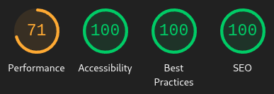

# LMS

An (incomplete) Learning Management System, written utilising [React](https://react.dev), [Django](https://djangoproject.com), and [Django Rest Framework](https://django-rest-framework.org).

## Setup

Please see the instructions in [docs/setup.md](docs/setup.md).

## Screenshots

Screenshots are located in [docs/screenshots.md](docs/screenshots.md) as to reduce clutter.

## Project Brief

I was tasked to develop a learning management system, where students can enroll onto courses, access learning content, and track their learning progress. It should also have functionality tailored to different user roles, so teachers can create and manage courses and so can admins, but only admins can manage users.

The frontend should be using React, while integrating a Django backend.

There should be authentication, data should be handled securely, and content management should be effective through a structured design. SQLite should be used as the default database as it ensures easy deployment, while satisfying necessary relation database functionalities.

Courses should have a title and a description, and there should be user registration, login, and role-based access control.

The Django backend should have REST endpoints, and there should be a test suite for both the frontend and backend.

## Key Elements

Not all of these are satisfied due to time constraints.

- Students should be able to:
	- ❌ Browse available courses
	- ❌ Enrol onto a course
	- ✅ Access a list of courses they are enroled in
	- ✅ Access course content
- Teachers should be able to:
	- 🚧 Create and manage courses
- Admins should be able to:
	- 🚧 Create and manage courses
	- 🚧 Create and manage users
- 🚧 User Roles and Authentication
- 🚧 REST API
- ❌ Automated tests
- ❌ Wireframes in documentation

For creating and managing courses and users, the pages for those are functionally complete, but they are not yet wired up to an API. (Creating course *modules* however, isn't complete and doesn't have a page, but that wasn't explicitly mentioned in the brief.)

For User Roles and Authentication, frontend almost has authentication complete and lets you log in, but you cannot log out, and role-based access determined through a property in the `<RequireAuth>` component used in the router is not yet functional.

The Django backend with proper REST API is close to completion, however not yet fully usable with the frontend. You can create, list and modify courses, modules and users. But you cannot create enrolments and module completions. You can however, *view* the courses a user has enroled in, module completion and a user's activity.

The Django backend can do token authentication and authorization, however there is not yet a proper role system. It only distinguishes between User and Admin, not Student, Teacher and Admin.

The current usable backend is a dumb backend that returns static responses that the frontend is able to parse. The Django backend can create a SQLite database, but contains no initial data. The Django backend could *almost* be usable by changing `ORIGIN` in `api.js` had some changes in serialisation been accounted for in the frontend.

## Constraints

*Time* was the biggest constraint. Whilst by the deadline I had got most of it completed, the backend, integration of the backend, and numerous other pages were left unfinished and unusable, as well as code not being the best as it was rushed. A list of things remaining to do include:

- Student
	- Dashboard
		- Achievements card
		- See about putting something on same row as Recent Activity so there's less whitespace
	- Activity page
		- Currently empty
	- Library
		- Currently empty. Without this, you cannot enrol onto a course
	- Course
		- No unenrol button
	- Module completion system
		- Possibly easiest bet to implement this - assuming course content will be hosted on an external server - would be to make the module content iframe listen for messages posted from within it, and say it's `{"type": "completed"}`, then the page containing the iframe shall send an API request to the server saying the module has been completed. This avoids needing to pass user tokens and other relevant API data into the iframe
	- Help
- Admin
	- Dashboard
		- Currently empty
		- Statistics (e.g., recent enrolments and completions)
	- Course
		- Currently empty
		- No option to create module
		- No way to change course details & visibility
			- Courses are hidden by default as to avoid newly created courses with incomplete content from being visible to students
		- No way to see which users are enroled onto a course (and when, and their completion)
		- No way to manually enrol/unenrol a user onto a course (if it's not public)
	- User
		- Clicking on a course should link to a list of modules the selected user has completed
		- Cannot delete or deactivate a user
		- Activity tab should have more statistics
	- Help
- Frontend
	- Pagination
	- Error pages & handling
		- Only page that exists so far is a 404 page, but if anything else happens, you'd be left with a blank page
	- Ability to sort table columns
	- `RequireAuth`'s `role` property does not yet check roles
		- It should show a 403 Forbidden page if the user visiting does not have any allowed role
	- Log out does not work
		- You need to manually remove `token` from `localStorage`
	- Make circular progress bar green when 100%
	- Revamp CSS colours: As to be more consistent, move more colours to variables, or also move to SCSS variables?
		- Would allow adjusting brightness etc from code
	- No default image for courses & modules
	- Cannot remove accidental image upload from the course creation form unless you refresh
	- Drag & drop on image upload boxes
- Backend
	- No proper concept of student/teacher/admin roles
	- No token expiry
	- Responses aren't as optimised as they could be (contain data that likely isn't going to be shown)
	- No endpoint to enrol onto a course
	- No endpoint to submit a module completion
- General
	- Reformat code and clean it (for consistency, and because some things were rushed and aren't as ideal as they could be)
	- Test suite
	- Documentation has no wireframes

Had I had more time, I feel I could have got this done to a really good standard.

## Validation

As I use React JSX and SCSS a lot, I'm unable to utilise the usual W3C HTML and CSS validators, perhaps unless I somehow compile the JSX and SCSS output.

The only issue with the JSX I can point out is that not every `<li>` has a `key`. This causes React to warn in the browser console.

Due to time constraints, I was unable to write tests for the frontend and backend.

## Accessibility

### Testing

#### Lighthouse

Testing with Lighthouse gives almost full scores:

Performance being so low doesn't wholly appear to be my fault, as a large amount of JavaScript is caused by running it in the development server, Google Fonts has latency, and Unsplash (where I source these stock images) takes a notice amount of time to load images from.

The SEO score was not full until [2602e60](https://github.com/Insaniquarium/lms/commit/2602e60) which added a stub robots.txt and meta description tag.

Best practices can still sometimes fluctuate between 90-100, as it in some situations may complain about the low resolution of the placeholder logo image, or because of the aforementioned React `<li>` `key` issue on pages that have them.

#### Screen Readers

Unfortunately, I did not have enough time to test with screen readers. I would expect it to be better in some ways than the quiz though, especially as I'd hope the focusing issue isn't present as I'm not doing SPA page switching myself, as that's React Router's job.

## Deployment

Unfortunately, I have not had enough time to try setting up such a monorepo with cloud deployment services such as Netlify.
